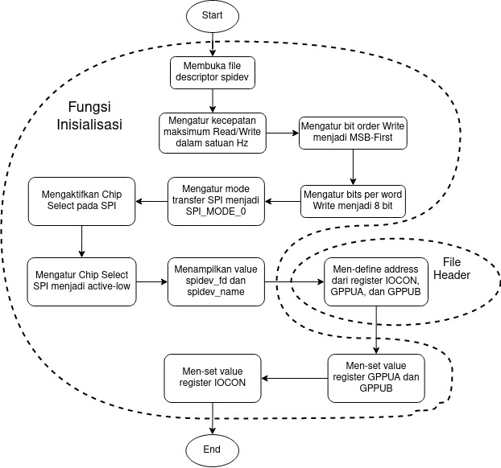
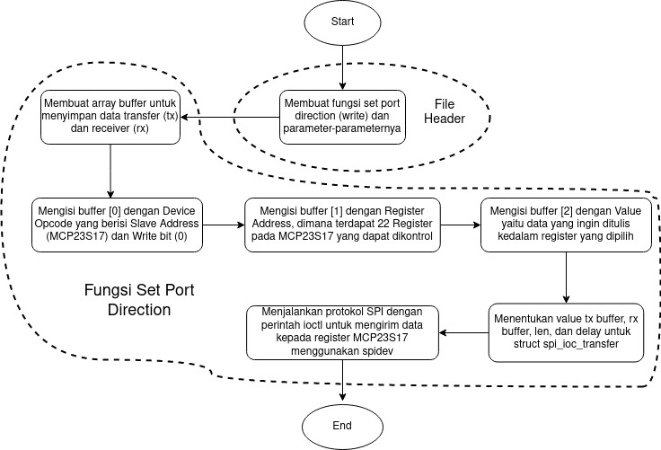
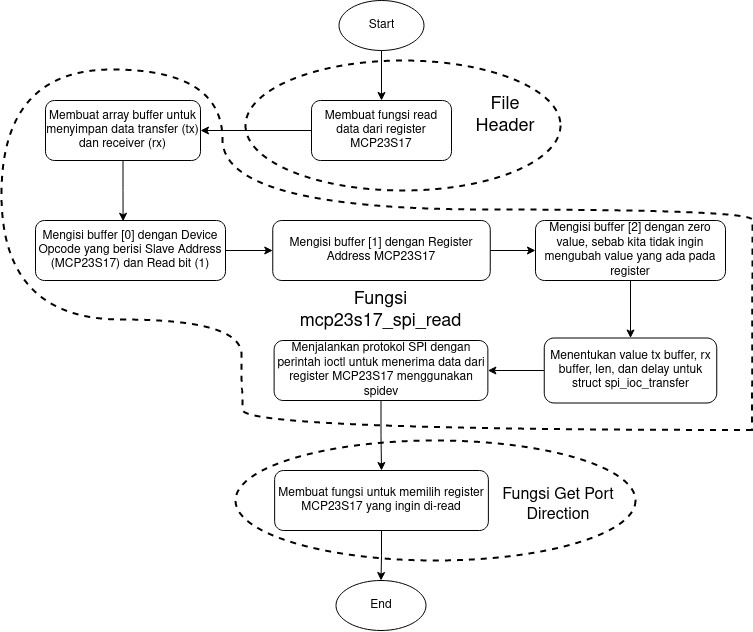
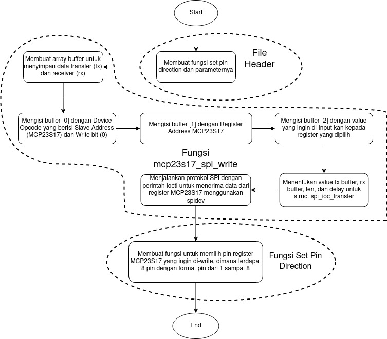
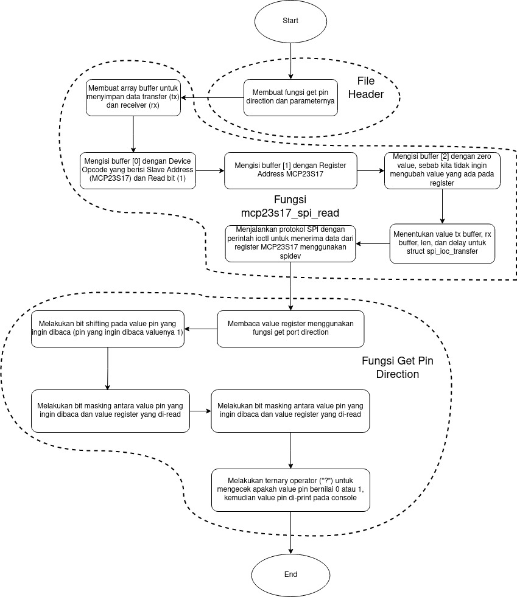
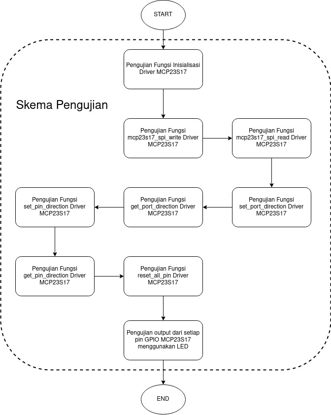

# MCP23S17

# About
Linux-based firmware project to control MCP23S17 through SPI (Serial Peripheral Interface)

# Block Diagram 
In Indonesian
- ## 1. Initialization Function

 

- ## 2. Set Port Direction Function

 

- ## 3. Get Port Direction Function

 

- ## 4. Set Pin Direction Function

 

- ## 5. Get Pin Direction Function

 

- ## 6. Testing

 

# Our team
- Evandrew Reynald Collin (Sepuluh Nopember Institute of Technology)
- Azzahra Nadya Kahpiasa (Telkom University)
